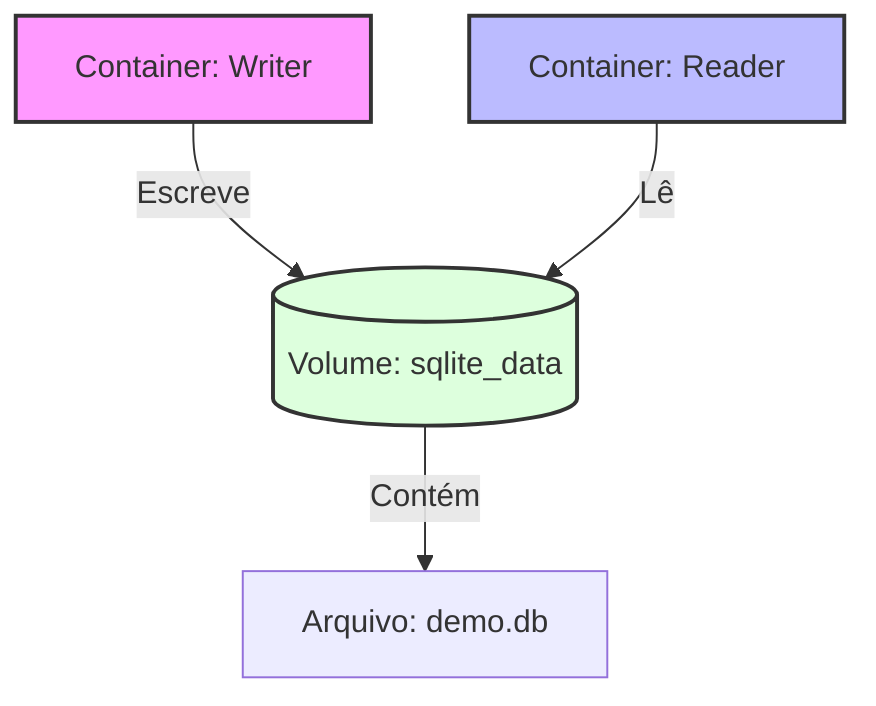

# Docker Volumes: Persistência com SQLite


Este projeto é uma prova de conceito (PoC) que demonstra, de ponta a ponta, como persistir dados para além do ciclo de vida dos containers.

Utilizando **Docker Volumes**, dois microsservicos Python compartilham o mesmo armazenamento: um escreve dados (*writer*) e o outro lê (*reader*), comprovando que o banco de dados sobrevive mesmo após a remoção dos containers.

## 🏗 Arquitetura e Decisões Técnicas

A solução foi projetada para ser leve e didática, focando no mecanismo de volumes do Docker:

* **Linguagem & Runtime**: Python 3.12 rodando sobre Alpine Linux (`python:3.12-alpine`) para garantir imagens finais extremamente pequenas.
* **Persistência (O Coração do Projeto)**:
    * Um **Volume Nomeado** (`sqlite_data`) é montado no diretório `/data` de ambos os containers.
    * O banco SQLite (`demo.db`) reside neste volume, isolado do sistema de arquivos efêmero do container.
* **Orquestração**: O `docker-compose.yml` gerencia o ciclo de build e garante que ambos os serviços "enxerguem" o mesmo volume virtual.

### Fluxo de Dados



🚀 Guia de Execução
Siga os passos abaixo para validar a persistência dos dados.

1. Construir a Imagem
Gera a imagem base que será utilizada tanto pelo writer quanto pelo reader.

```bash
docker compose build
```

2. Gerar Dados (Writer)
Este comando sobe o container, cria o banco de dados no volume, insere registros (Alice, Bruno, Carla) e depois se autodestrói.

```bash
docker compose run --rm writer
```

3. Ler Dados (Reader)
Agora subimos um novo container limpo. Ele montará o mesmo volume e lerá o arquivo deixado pelo passo anterior.

```bash
docker compose run --rm reader
```

Output:

```bash
Lendo banco de dados em: /data/demo.db
Clientes encontrados:
1: Alice
2: Bruno
3: Carla
```

🧹 Limpeza
Para remover os containers, redes e apagar o volume (excluindo o banco de dados definitivamente):

```bash
# O flag -v é crucial para remover o volume nomeado
docker compose down -v
```
